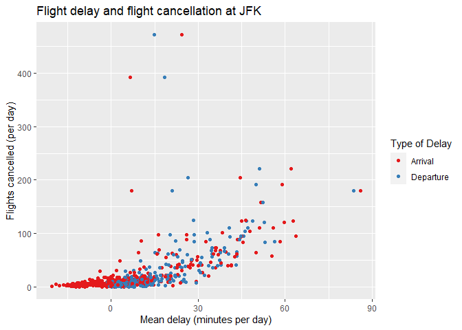

Assignment 1
================
Andrew Tu
9/27/2022

## Question 1

Which plane (tailnum) has the worst on-time record?

``` r
flights%>%
  filter(is.na(dep_time))%>%
  nrow()
```

    ## [1] 8255

8255 flights have missing departure time

``` r
which(colSums(is.na(flights))>0)
```

    ##  dep_time dep_delay  arr_time arr_delay   tailnum  air_time 
    ##         4         6         7         9        12        15

other than dep_time, the columns dep_delay, arr_time, arr_delay,
tailnum, and air_time are also missing. Departure delay, arrival time,
arrival delay and air time can be NA because a flight was cancelled,
tailnum can be missing if it is an unregistered flight or a secret
government chartered flight.

## Question 2

Currently dep_time and sched_dep_time are convenient to look at, but
hard to compute with because they’re not really continuous numbers.
Convert them to a more convenient representation of number of minutes
since midnight.

``` r
flights_2 <- flights %>% 
  mutate(
    dep_time = ((dep_time %/% 100) * 60 + (dep_time %% 100))%%(24*60),
    sched_dep_time = ((sched_dep_time %/% 100) * 60 + (sched_dep_time %% 100))%%(24*60)
    )

flights_2
```

    ## # A tibble: 336,776 x 19
    ##     year month   day dep_time sched_dep_time dep_delay arr_time sched_arr_time
    ##    <int> <int> <int>    <dbl>          <dbl>     <dbl>    <int>          <int>
    ##  1  2013     1     1      317            315         2      830            819
    ##  2  2013     1     1      333            329         4      850            830
    ##  3  2013     1     1      342            340         2      923            850
    ##  4  2013     1     1      344            345        -1     1004           1022
    ##  5  2013     1     1      354            360        -6      812            837
    ##  6  2013     1     1      354            358        -4      740            728
    ##  7  2013     1     1      355            360        -5      913            854
    ##  8  2013     1     1      357            360        -3      709            723
    ##  9  2013     1     1      357            360        -3      838            846
    ## 10  2013     1     1      358            360        -2      753            745
    ## # ... with 336,766 more rows, and 11 more variables: arr_delay <dbl>,
    ## #   carrier <chr>, flight <int>, tailnum <chr>, origin <chr>, dest <chr>,
    ## #   air_time <dbl>, distance <dbl>, hour <dbl>, minute <dbl>, time_hour <dttm>

## Question 3

Look at the number of canceled flights per day. Is there a pattern? Is
the proportion of canceled flights related to the average delay? Use
multiple dyplr operations, all on one line, concluding with
ggplot(aes(x= ,y=)) + geom_point()

``` r
flights_3 = flights_2 %>%
  group_by(year,month,day) %>%
  summarise(
    daily_cancelled = sum(is.na(air_time)&is.na(dep_time)&is.na(arr_time)&is.na(arr_delay)),
    mean_arr_delay = mean(arr_delay, na.rm = TRUE),
    mean_dep_delay = mean(dep_delay, na.rm = TRUE)
    )%>%
  ungroup()%>%
  select(c('daily_cancelled','mean_arr_delay','mean_dep_delay'))%>%
  pivot_longer(cols = c('mean_arr_delay','mean_dep_delay'),names_to = 'delay_type', values_to = 'delay')
```

    ## `summarise()` has grouped output by 'year', 'month'. You can override using the
    ## `.groups` argument.

``` r
ggplot(flights_3, aes(x = delay, y = daily_cancelled, color = delay_type))+
  geom_point()+
  labs(x = "Mean delay (minutes per day)", y = "Flights cancelled (per day)", color = 'Type of Delay')+
  ggtitle('Flight delay and flight cancellation at JFK')+
  scale_color_brewer(palette='Set1',labels=c('Arrival', 'Departure'))
```

<!-- -->

There appears to be a positive correlation between flight delays and
flight cancellations of that day, however the correlation does not
appear to be linearD
