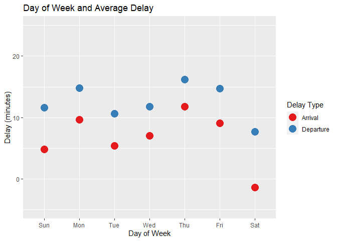

hw2
================
Andrew Tu
10/14/2022

What time of day should you fly if you want to avoid delays as much as
possible?

``` r
flights_dt = flights %>%
  mutate(time = with_tz(as_datetime(time_hour), tzone = "US/Eastern"))

minute(flights_dt$time) <- flights_dt$minute

flights_delay = flights_dt%>%
  group_by(hour)%>%
  summarise(
    mean_arr_delay = mean(arr_delay, na.rm = TRUE),
    mean_dep_delay = mean(dep_delay, na.rm = TRUE))%>%
  pivot_longer(
    cols = c('mean_arr_delay','mean_dep_delay'),
    names_to = 'delay_type', 
    values_to = 'delay')

flights_delay$delay_type <- factor(
  flights_delay$delay_type,
  levels = c("mean_dep_delay","mean_arr_delay"),
  labels = c( "Departure Delay","Arrival Delay"))
```

``` r
ggplot(flights_delay)+
  geom_col(aes(x = hour, y = delay))+
  facet_wrap(~delay_type)+
  ylab('Delay (minutes)')+
  ggtitle('Delays and Scheduled Departure Time')
```

    ## Warning: Removed 2 rows containing missing values (position_stack).

<!-- -->

``` r
# ggplot(flights_delay)+
#   geom_bar(stat='identity',aes(x = hour, y = mean_dep_delay))
```

There appears to be fewer delays early in the morning, with delays
peaking out at around 7 to 9 PM.

Does this choice depend on anything? Season? Weather? Airport? Airline?
Find three patterns (“null results” are ok!). Write your results into
Rmarkdown. Include a short introduction that summarizes the three
results. Then, have a section for each finding. Support each finding
with data summaries and visualizations. Include your code when
necessary. This shouldn’t be long, but it might take some time to find
the things you want to talk about and lay them out in an orderly way.

``` r
flights_season = flights_dt%>%
  mutate(season = quarter(time))%>%
  mutate(season = recode_factor(season, "1" = "Spring", "2" = "Summer", "3" = "Fall", "4" = "Winter"))

ggplot(flights_season, aes(x= season, y = arr_delay))+
  #borrowed from https://stackoverflow.com/questions/48936704/manual-specification-of-draw-quantile-argument-in-violin-plot-call-in-r
  geom_violin(draw_quantiles = c(0.25, 0.5, 0.75), linetype = "dashed")+
  geom_violin(fill="transparent",draw_quantiles = 0.5) +
  stat_summary(fun.y=mean, geom="point", shape=20, size=7, color="red", fill="red")+
  ylim(-100,200)+
  ylab("Arrival Delay")
```

    ## Warning: `fun.y` is deprecated. Use `fun` instead.

    ## Warning: Removed 12230 rows containing non-finite values (stat_ydensity).
    ## Removed 12230 rows containing non-finite values (stat_ydensity).

    ## Warning: Removed 12230 rows containing non-finite values (stat_summary).

<!-- -->

``` r
ggplot(flights_season, aes(x= season, y = dep_delay))+
  #borrowed from https://stackoverflow.com/questions/48936704/manual-specification-of-draw-quantile-argument-in-violin-plot-call-in-r
  geom_violin(draw_quantiles = c(0.25, 0.5, 0.75), linetype = "dashed")+
  geom_violin(fill="transparent",draw_quantiles = 0.5) +
  stat_summary(fun.y=mean, geom="point", shape=20, size=7, color="red", fill="red")+
  ylim(-30,100)+
  ylab("Departure Delay")
```

    ## Warning: `fun.y` is deprecated. Use `fun` instead.

    ## Warning: Removed 21604 rows containing non-finite values (stat_ydensity).
    ## Removed 21604 rows containing non-finite values (stat_ydensity).

    ## Warning: Removed 21604 rows containing non-finite values (stat_summary).

<!-- --> There does not appear to
be any major differences between the 4 seasons in terms of arrival or
departure delays

``` r
flights_airport = flights_dt%>%
  group_by(origin)%>%
  summarise(
    mean_arr_delay = mean(arr_delay, na.rm = TRUE),
    mean_dep_delay = mean(dep_delay, na.rm = TRUE))%>%
  pivot_longer(cols = c("mean_arr_delay","mean_dep_delay"),
               values_to = "delay",
               names_to = "delay_type")
ggplot(flights_airport,aes(x = origin,y = delay, color = delay_type))+
  geom_point(size = 7)+
  scale_color_brewer(palette='Set1',labels=c('Arrival', 'Departure'))+
  guides(color=guide_legend(title="Delay Type"),size = FALSE)+
  ylab('Delay (minutes)')+
  ggtitle('Airport and Average Delay')+
  xlab('Airport')+
  ylim(0,18)
```

    ## Warning: `guides(<scale> = FALSE)` is deprecated. Please use `guides(<scale> =
    ## "none")` instead.

<!-- --> Newark is the worst in
terms of delays, LaGuardia has less departure delay but greater arrival
delay at the destination airport compared to JFK.

``` r
flight_weekday = flights_dt%>%
  mutate(day_week = wday(time, label = TRUE))%>%
  group_by(day_week)%>%
  summarise(
  mean_arr_delay = mean(arr_delay, na.rm = TRUE),
  mean_dep_delay = mean(dep_delay, na.rm = TRUE))%>%
  pivot_longer(
  cols = c('mean_arr_delay','mean_dep_delay'),
  names_to = 'delay_type', 
  values_to = 'delay')

ggplot(flight_weekday, aes(x = day_week, y = delay, color = delay_type))+
  geom_point(size = 5)+
  scale_color_brewer(palette='Set1',labels=c('Arrival', 'Departure'))+
  guides(color=guide_legend(title="Delay Type"),size = FALSE)+
  ylab('Delay (minutes)')+
  ggtitle('Day of Week and Average Delay')+
  xlab('Day of Week')+
  ylim(-5,25)
```

    ## Warning: `guides(<scale> = FALSE)` is deprecated. Please use `guides(<scale> =
    ## "none")` instead.

<!-- --> Earlier and Later in the
week there are more delays, with fewer on Tuesday and Wednesdays, and
surprisingly fewest delays on Saturday, with planes actually Arriving
before schedule.
