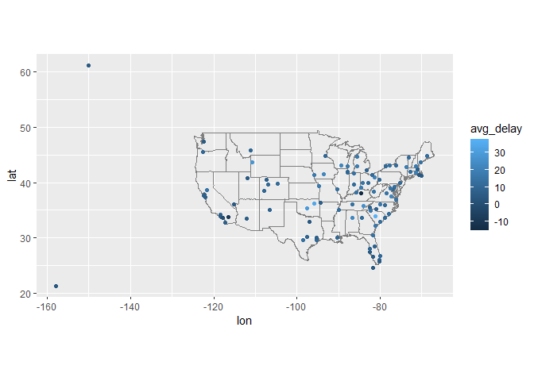
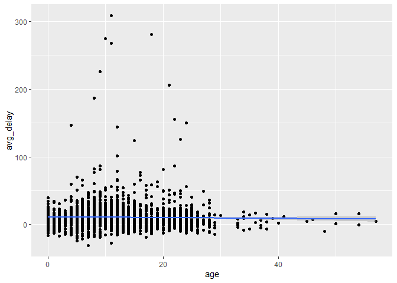

hw3
================
Andrew Tu
2022-10-19

# Q1

Compute the average delay by destination, then join on the airports data
frame so you can show the spatial distribution of delays. Here’s an easy
way to draw a map of the United States:

``` r
# airports %>%
#   semi_join(flights, c("faa" = "dest")) %>%
#   ggplot(aes(lon, lat)) +
#     borders("state") +
#     geom_point() +
#     coord_quickmap()
airport_loc = airports%>%
  mutate(dest = faa)%>%
  select(dest,lat,lon)

flights_1 = flights%>%
  group_by(dest)%>%
  mutate(avg_delay = (dep_delay+arr_delay)/2)%>%
  summarise(avg_delay = mean(avg_delay,na.rm = TRUE))%>%
  left_join(airport_loc, 'dest')

ggplot(flights_1,aes(lon, lat)) +
  borders("state") +
  geom_point(aes(color = avg_delay)) +
  coord_quickmap()
```

    ## Warning: Removed 4 rows containing missing values (geom_point).

<!-- -->

# Q2

Add the location of the origin and destination (i.e. the lat and lon) to
flights.

``` r
airport_ori = airports%>%
  rename(lat_ori = lat)%>%
  rename(lon_ori =  lon)%>%
  select(faa,lon_ori,lat_ori)

airport_dest = airports%>%
  rename(lat_dest = lat)%>%
  rename(lon_dest =  lon)%>%
  select(faa,lat_dest,lon_dest)

flights%>%
  left_join(airport_ori,c("origin" = "faa"))%>%
  left_join(airport_dest,c("dest" = "faa"))
```

    ## # A tibble: 336,776 x 23
    ##     year month   day dep_time sched_dep_time dep_delay arr_time sched_arr_time
    ##    <int> <int> <int>    <int>          <int>     <dbl>    <int>          <int>
    ##  1  2013     1     1      517            515         2      830            819
    ##  2  2013     1     1      533            529         4      850            830
    ##  3  2013     1     1      542            540         2      923            850
    ##  4  2013     1     1      544            545        -1     1004           1022
    ##  5  2013     1     1      554            600        -6      812            837
    ##  6  2013     1     1      554            558        -4      740            728
    ##  7  2013     1     1      555            600        -5      913            854
    ##  8  2013     1     1      557            600        -3      709            723
    ##  9  2013     1     1      557            600        -3      838            846
    ## 10  2013     1     1      558            600        -2      753            745
    ## # ... with 336,766 more rows, and 15 more variables: arr_delay <dbl>,
    ## #   carrier <chr>, flight <int>, tailnum <chr>, origin <chr>, dest <chr>,
    ## #   air_time <dbl>, distance <dbl>, hour <dbl>, minute <dbl>, time_hour <dttm>,
    ## #   lon_ori <dbl>, lat_ori <dbl>, lat_dest <dbl>, lon_dest <dbl>

# q3

Is there a relationship between the age of a plane and its delays?

``` r
plane_age = planes%>%
  mutate(age = 2013-year)%>%
  select(tailnum,age)

flights_3 = flights%>%
  group_by(tailnum)%>%
  mutate(avg_delay = (dep_delay+arr_delay)/2)%>%
  summarise(avg_delay = mean(avg_delay,na.rm = TRUE))%>%
  left_join(plane_age, 'tailnum')
ggplot(flights_3,aes(age,avg_delay))+
  geom_point()+
  geom_smooth(method = 'lm')
```

    ## `geom_smooth()` using formula 'y ~ x'

    ## Warning: Removed 798 rows containing non-finite values (stat_smooth).

    ## Warning: Removed 798 rows containing missing values (geom_point).

<!-- --> There doesn’t appear to be
any correlation between plane age and aggregate arrival and departure
delay. There are a few outliers with high delays in the younger planes,
alhough this could entirely be due to there being a greater number of
planes under the ae of 25. The linear regression concurs with this
finding.
